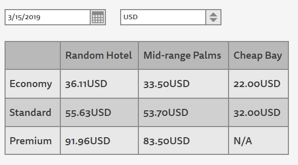

## TypeScript task

The goal of this task is to create a apartments price comparison page for different hotels.



Page consists of three elements:

- **Datepicker** - standard browser `input` with type `date`. Allowed dates are from `2019-03-11` to `2019-03-17` should be specified in HTML. *Defaults to: `2019-03-11`*
- **Selectbox** - `select` element with three options: `EUR`, `UAH`, and `USD`. *Defaults to: `USD`*
- **Results table** - table that displays rooms prices for selected date and currency. Its values should be recalculated when either date or currency are changed. Room types and hotel names are fixed.

All code should be implemented in TypeScript and covered with types. Do not use `any` type without strong need.

> **NOTE:** Do not forget to create `tsconfig.json`

### Part 1: Currency converter

Implement `Converter` class that should implement `CurrencyConverter` interface.

Initial types are provided in [`converter.ts`](src/converter.ts).

1. Change class declaration to ensure that class will implement correct interface.

1. `Converter` constructor should accept two numbers - exchange rates for `USD` to `UAH` and `EUR` to `UAH`. Use `26.5` and `29.9` respectively for task implementation.

1. Implement private method `_createCurrancyMap` that will create conversion rates map during instance creation.

1. Store conversion rates map in private property `_map`. You should be able to get exchange rate from `USD` to `EUR` as `this._map['USD']['EUR']`

1. Implement other methods specified in `CurrencyConverter` interface.

### Part 2: Parse hotel data

JSON files with pricing information can be found in `data` folder.

Each file its own data format. You goal is to convert them to unified format that will be convenient for you to use. (Be careful with date format used in `Cheap Bay`)

Create type for unified format and necessary parse functions for each type of data that will return data of unified type.

For each hotel you should use ES2015 `Map` to store normalized pricing information.

### Part 3: Render function

Create file `render-table.ts` that should export single `renderTable` function that should implement next signature:

```ts
renderTable(container: HTMLElement, data: YourType): void
```

- `container` - element where you should insert **Results table**

- `data` - pricing data in format that is convenient for you. Replace `YourType` with actual type format that you will expect in this function.

You can use ES2015 templates literals, other template engine (e.g. `_.template`), or DOM API to update table.

Price should be rendered with 2 decimal digits and currency (selected by user).

If there is no price information for room - `N/A` should be rendered.

### Part 4: Application

Create HTML with datepicker, select and container block for results table as shown above.

Use `document.querySelector` with proper generic type for retrieving elements mentioned above from DOM. Exception should be thrown if any of expected elements is missing.

Application should parse pricing data from three sources and render results table after each change in datepicker or select. All prices should be converted to selected currency.

Initial data should be rendered according to data from HTML specified in initial values.

### Part 5: Webpack

You should use `webpack` to create builds in production mode and `webpack-dev-server` for development.

For simplicity use raw `ts-loader` without additional plugins for checker. See [ts-loader docs](https://github.com/TypeStrong/ts-loader) for examples.
